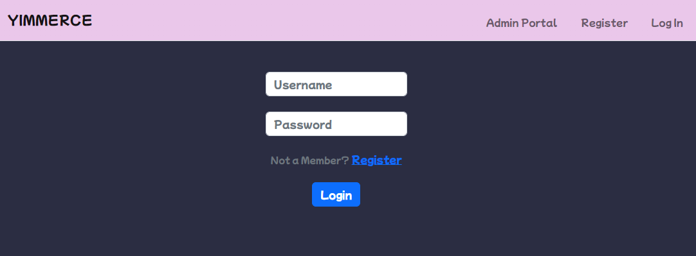
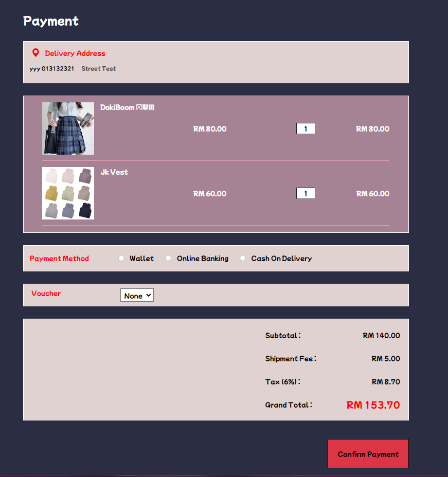

# Yimmerce Web Applicaion

### Video Demo :

### Description

This is an E-commerce web application which is build
by using Python Flask as backend, and
simple HTML, CSS, and JS at frontend. MySQL is the backbone in this web application,
which it acts as a database for me to access and manage data.

This web application help both user and seller to gain a lot of advantages, which
the most importance thing is the buying/selling products. By using this web application,
all the tedious process such as recording down the order details manually on
a book can be eliminated. What's more is that, there are plenty of useful features, such as
a live chat between user and seller, vouchers for discounting price, and user wallet for paying.
---

### Table of Content

- [User](#User)
- [Admin](#Admin)
- [Validation](#Validation)
- [ERD](#Entity Relationship Diagram (ERD) )
- [Setting Up Project](#Setting Up This Project)

---

#### User

There are many operations can be performed by this role. User can make an order through this web application, checking
the product at the main page,
filter product result by the product name, adding product items into cart, and placing order.

Furthermore, users can also check their purchase history, have a live chat with the seller, and
check the notifications such as placing a successful order, or
after changing his/her password. 

Moreover, the users can also rate the order list of the orders, which can provide
feedback, and also a better consideration for other potential buyers. After rating, the users can also view back their
previous ratings as well. 

Last but not least, it's the wallet feature.
User can deposit or withdraw money to/from the wallet. On the payment window, user can choose wallet
as a payment option as well. Note that this the process of withdrawal or deposit is not engaged with real
payment gateway, it's sorely made for this project virtually only.

1. User Login

2. User Register

3. Main Page

4. Product Page

5. Ratings in Product Page

6. Cart

7. Payment Page

8. Purchase History

9. Notification Page

10. Chat

11. Claim Voucher Page

12. Rate Product by Bootstrap Modal

13. Check Previous Ratings

14. Wallet

15. Deposit & Withdraw

16. Check redeemed voucher

17. Personal Details

18. Edit Personal Details

19. Change Password

20. Navbar

---

#### Admin

Seller is privileged to perform almost all the CRUD (Create, Read, Update, Delete) available such
as products and vouchers. In this web application, everything
is automated, in which seller is not needed to involve in the buying process except
answering enquires from the potential buyers.

All the orders, will be automatically recorded, and
seller can update the shipment status when it is ready, shipped, or delivered. Besides, a CRUD on
products is pretty essential for an E-commerce web application too. Thus, I have implemented
to let seller creating product, updating product, and deleting product comfortably by using Bootstrap Modal.
Seller can update a product, in which the modal will automatically fill up all the previous details of the product,
where seller only need to make a bit of change without filling up all the details manually again and again.

The notification is pretty crucial for the seller too, where all the orders which has newly been placed will be informed
through here. The seller will not miss any orders at a smaller chance, and providing customers a better buying
experience. On the voucher page, seller can make a new voucher.

1. Login Page

2. Main Page

3. Product Page

4. Create Product

5. Update Product

6. Notifications

7. Chat

8. Voucher

9. Create Voucher

10. Ratings

11. Update Shipment Status (at main page)

12. Navbar

---

#### Validation

In my opinion, validation is necessary for every web application.
Thus, I implement it at anywhere where data corruption or errors may happen, this may include
some typo, falsify data intentionally, or value error such as filling up character at number field.
Thus, I have placed a lot of effort on validation, so that it can prevent my database to go wrong, server go downs,
getting sql injection attack,
and getting inaccurate data.

> Example of Validation

- Blank at necessary field

- Exceeds stock amount

- String in number field (ValueError)

---

#### Entity Relationship Diagram (ERD)

---

### Setting Up This Project

`git clone https://github.com/yii-meow/CS50X.git`

> cd into this project directory

`$ sudo apt install mysql-server`

`$ sudo service mysql start`

`$ sudo apt install pip`

`$ sudo apt install libmysqlclient-dev`

`$ sudo mysql -uroot`

`mysql> create schema yimmerce`

`mysql> use yimmerce`

> copy yimmerce.sql into mysql terminal

`mysql> exit`

`$ sudo pip install -r requirements.txt`

`$ flask start`

